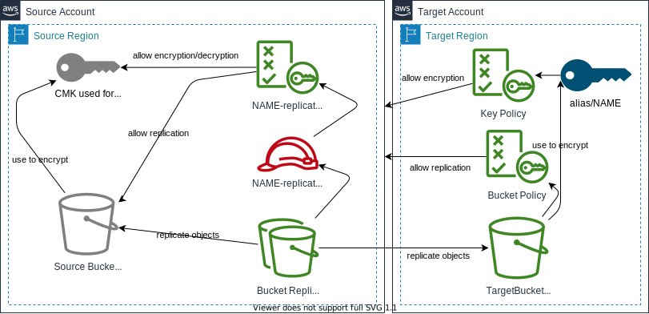

# S3 Cross Region Replication

Add cross region / cross account replication to an existing S3 Bucket.

## Requirements

- An existing S3 Bucket **with versioning enabled**
- Access to a different AWS account and/or region

## Architecture

- Source Bucket can be encrypted
- Versioning on Source Bucket will always be enabled (requirement for replication)
- Target Bucket will always be encrypted

## Parameters

| Variable                  | Type   | Default    | Description                                                                                                                                                                           |
| ------------------------- | ------ | ---------- | ------------------------------------------------------------------------------------------------------------------------------------------------------------------------------------- |
| `Name`                    | string | _none_     | Short name to describe the replication, will be used for Name tagging most ressources.                                                                                                |
| `SourceAccount`           | string | _none_     | AWS Account containing the source bucket.                                                                                                                                             |
| `SourceRegion`            | string | _none_     | AWS region containing the source bucket.                                                                                                                                              |
| `SourceBucketName`        | string | _none_     | Name of source S3 bucket. **NOTE: Versioning will be turned on for the Source Bucket.**                                                                                               |
| `SourceKeyID`             | string | `null`     | ID of the KMS Key used for Encryption of the source bucket, leave empty/null if source bucket is not encrypted.                                                                       |
| `TargetAccount`           | string | _none_     | AWS Account for the target bucket.                                                                                                                                                    |
| `TargetRegion`            | string | _none_     | AWS region for the target bucket.                                                                                                                                                     |
| `TargetBucketName`        | string | _none_     | Name for target S3 bucket. **NOTE: The name must be DNS Compliant and globally unique.**                                                                                              |
| `ReplicationStorageClass` | string | `STANDARD` | Storage Class for replicated Data, Possible values: `STANDARD` `REDUCED_REDUNDANCY` `STANDARD_IA` `ONEZONE_IA` `INTELLIGENT_TIERING` `GLACIER` `DEEP_ARCHIVE` `OUTPOSTS` `GLACIER_IR` |
